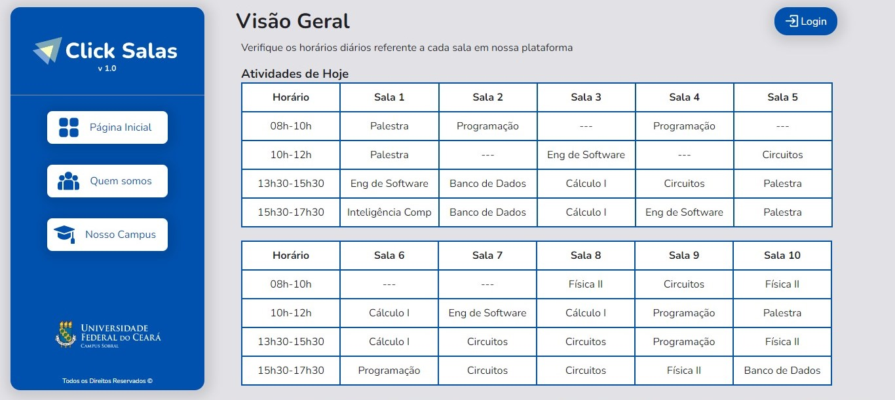
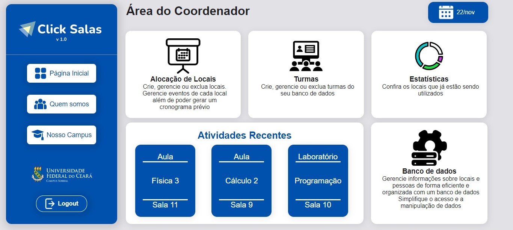

<h1 align="center">  
    
    <br>
    <p style="font-size:1rem; margin-top:1rem; font-weight:normal;">Sistema de Gerenciamento e Alocação de Salas</p>
</h1>

## Sobre

É um projeto dedicado a disciplina de Engenharia de Software, pensado em auxiliar a coordenadoria do Campus da UFC de Sobral, com gerenciamento de turmas em cada semestre.

## Tecnologias

<div style="display:flex; flex-direction: row;">
    
    
    
    
</div>

## Como utilizar

```bash
    # Clone o projeto
    $ git clone https://github.com/IsraelS1lv4/ClickSala-EngSoftware.git
```

```bash
    # Entre no diretório
    $ cd frontend_clickSalas
```

```bash
    # Instale as dependências
    $ npm install
```

## Telas
## Visão Geral de todos os usuários 
 
## Visão do usuário coordenador

